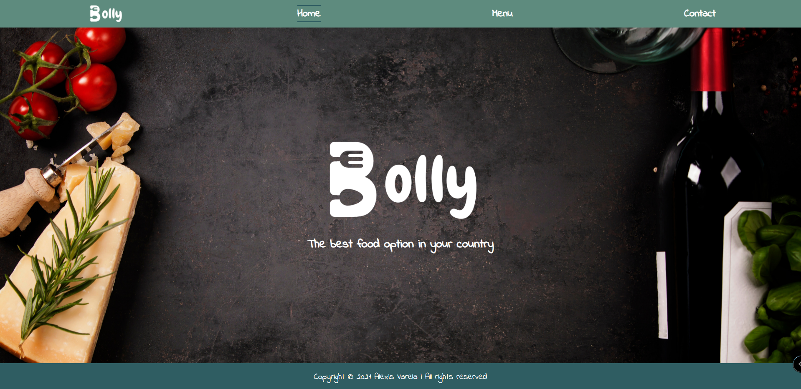

# JS-Restaurant

> This is a Restaurant landing page, where you can watch the information about the restaurant, all the menu, and a simple contact view, all of these are generated with JavaScript, and the styles are made with CSS.

# Application Screenshot


## Built With

- HTML
- CSS
- Javascript
- Webpack

## Live Demo

You can visit [here]() my app.

## Getting Started

To get a local copy up and running follow these simple example steps:

- Clone this repository with:
```
  https://github.com/alexisbec/JS-Restaurant.git
```
- Open the project folder where the repository was downloaded.
- Open the *index.html* file with your live server.
- Start the navigation throw the site using the tabs on the navbar.

## Prerequisites

- Web Browser
- Internet connection

## Author

👤 **Alexisbec**
- Github: [@alexisbec](https://github.com/alexisbec)
- Linkedin: [Alexis Varela](www.linkedin.com/in/alexbec)
- Twitter : [@AlexisV31667779](https://twitter.com/AlexisV31667779)


## 🤝 Contributing

Contributions, issues, and feature requests are welcome!

## Show your support

Give an ⭐️ if you like this project!

## 📝 License

This project is [MIT](https://github.com/alexisbec/JS-Restaurant/blob/development/LICENSE) licensed.